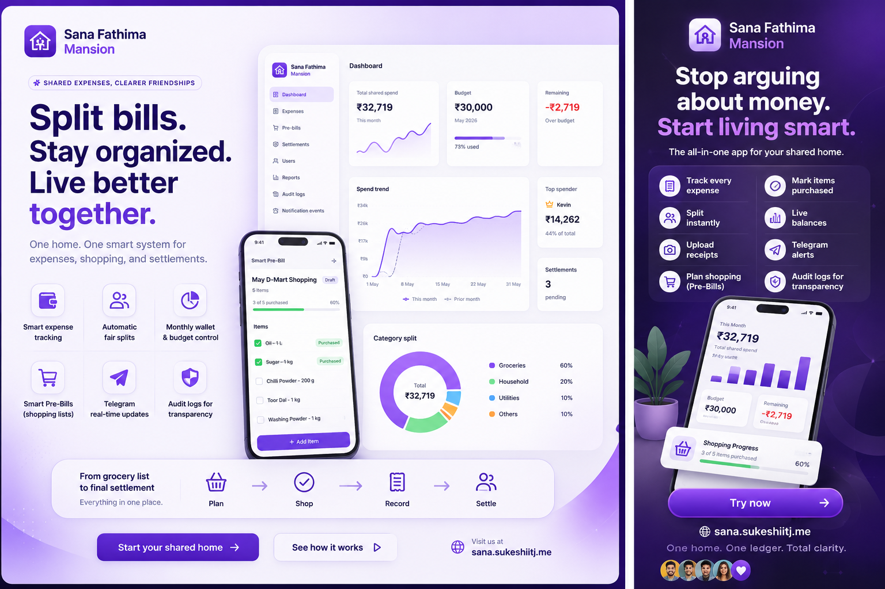

  

  <em>Shared walls, shared ledgers—know who paid, who owes, and where the month went, without living inside a spreadsheet.</em>

 

# Sana Fathima Mansion

**One household, one calm ledger.** Track shared spending, split fairly, see who owes whom, record settlements, and close the month with confidence—built for roommates and families who want clarity without spreadsheet chaos.

## What you can do

- **Log expenses** — Who paid, categories, notes, and optional receipt photos so nothing lives only in someone’s head.
- **Fair splits & house costs** — Shared bills split across roommates, plus “whole home” costs that count toward the month without skewing personal balances.
- **Live balances** — Balances update from real expenses and splits so arguments aren’t about arithmetic.
- **Monthly wallet** — Work month by month with budget context and carry-forward so planning stays grounded.
- **Settlements** — Record who paid whom and keep the story of the household straight.
- **Reports** — Summaries and exports when you need a paper trail or a quiet month-end review.
- **Smart pre-bills** — Shared shopping lists: draft, finalize, track what’s still pending, and optionally nudge the group when a list is ready or done.
- **Household roster** — Invite people in, keep everyone on the same page, and match sign-in to the right person in the ledger.
- **Sign in your way** — Email and password, or Google when it’s enabled for your deployment.
- **Optional Telegram** — Lightweight alerts for expenses, month milestones, and pre-bill updates—when your home wants the signal in chat.
- **Reminders & nudges** — Gentle check-ins when balances need attention or the month wraps—where your setup supports them.

## License

Private project — see repository owner for terms of use.
